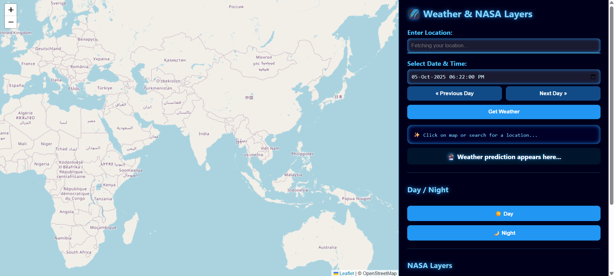

# NASA_Space_Apps_2025_Will_It_Rain_On_My_Parade
Star Forger is an interactive web app that visualizes real-time weather, NASA satellite imagery, and historical weather probabilities for any location and date. Instantly check the weather, overlay NASA cloud data, and analyze the chance of rain, wind, or heatwaves-perfect for planning your next event or just exploring our planet!
# Star Forger: Will It Rain On My Parade?

🌍 *Star Forger* is an interactive web application that combines real-time weather data, NASA satellite imagery, and historical weather analysis to help you answer:  
*"Will it rain on my parade?"*

## Features

- *Interactive 2D Map*: Click or search for any location on Earth.
- *Weather Data*: Instantly view temperature, wind speed, and humidity for your chosen time and place.
- *NASA Satellite Overlays*: Toggle VIIRS, MODIS Aqua, and MODIS Terra true-color imagery as map overlays.
- *Day/Night Mode*: Switch between day and night map backgrounds.
- *Historical Analysis*: Analyze the probability of heavy rain, strong winds, heatwaves, and muggy days for a specific date across the last decade.
- *Modern UI*: Futuristic, responsive sidebar and controls.

## Demo

  
Example: Weather and satellite overlays for your location.

## Getting Started

### Prerequisites

- Python 3.7+
- pip

### Installation

1. *Clone the repository:*
   sh
   git clone https://github.com/yourusername/star-forger.git
   cd star-forger
   

2. *Install dependencies:*
   sh
   pip install flask requests
   

3. *Run the server:*
   sh
   python server.py
   

4. *Open your browser and visit:*
   
   http://127.0.0.1:5000/
   

### File Structure

- server.py — Flask backend, API endpoints, and HTML rendering.
- predict_weather.py — NASA POWER API integration and historical weather analysis logic.
- templates/index.html — Landing page with project intro and team info.
- templates/nasa_2d.html — Main web application UI (Leaflet map, controls, JS logic).
- static/Member/ — Team member images.

### API Usage

- / — Landing page.
- /app — Main application.
- /analyze — API endpoint for historical weather analysis.  
  Example:  
 
  /analyze?lat=21.17&lon=72.83&month=5&day=15&conditions=precipitation_gt_25,wind_speed_gt_10
 

## Data Sources

- [NASA POWER API](https://power.larc.nasa.gov/)
- [Open-Meteo Archive API](https://open-meteo.com/)
- [NASA GIBS Satellite Imagery](https://earthdata.nasa.gov/gibs)
- [OpenStreetMap & Nominatim](https://www.openstreetmap.org/)

## Team

- Dev Patel (Project Lead)
- Abhi Suthar (Member)
- Akshat Chauhan (Member)
- Aryan Sariya (Member)

## License

MIT License

---

Designed with 💙 Space Inspiration
